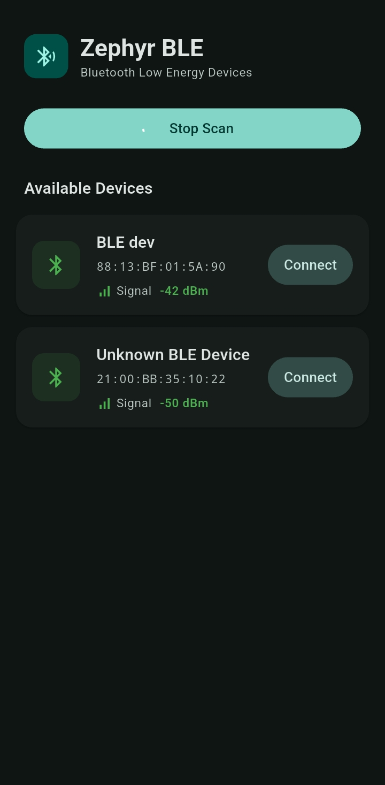
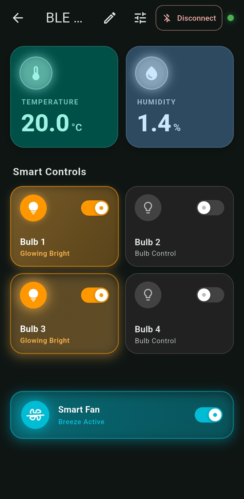
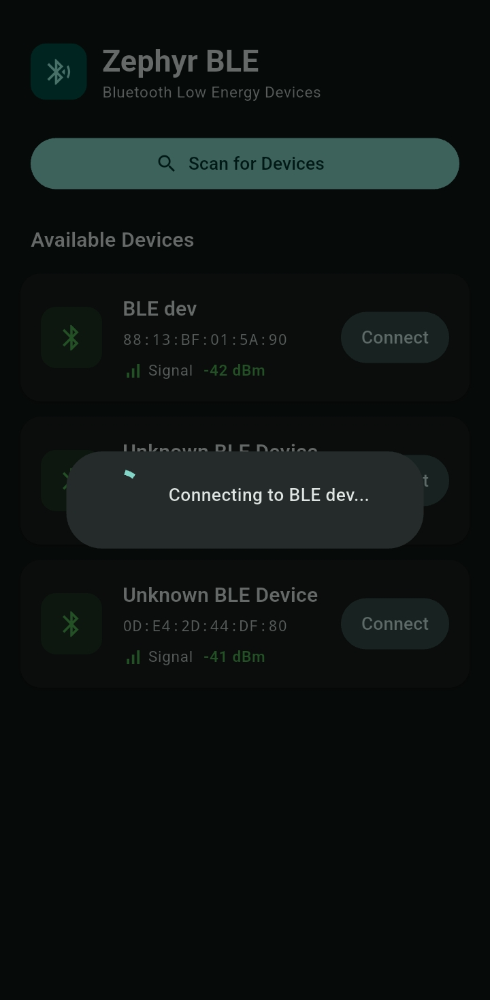

# BLE-Based Home Automation Using Zephyr RTOS & Flutter

A Bluetooth Low Energy (BLE) home automation project consisting of an **ESP32-based peripheral device running Zephyr RTOS** and a **Flutter-based Android application**.

The ESP32 peripheral implements **custom GATT services and characteristics** for device control and sensor data exchange. The Flutter Android application connects to the peripheral and provides a user interface for monitoring and controlling the device.

---

## 📌 Project Overview

This project demonstrates BLE communication between an **ESP32 embedded device** and an **Android application**.

The embedded peripheral is developed using **Zephyr RTOS**, with a customized BLE GATT architecture designed for:

* Device control
* Sensor data monitoring
* BLE read/write communication
* BLE notifications
* Custom GATT services and characteristics

The Android application is developed using **Flutter** and communicates with the ESP32 peripheral through BLE.

### System Architecture

```text
┌──────────────────────────────┐
│       Flutter Android App    │
│                              │
│        "Zep BLE"             │
│                              │
│  • BLE Device Discovery      │
│  • Connect / Disconnect      │
│  • Device Control            │
│  • Sensor Data Monitoring    │
└──────────────┬───────────────┘
               │
               │ Bluetooth Low Energy
               │
               ▼
┌──────────────────────────────┐
│      ESP32 BLE Peripheral    │
│                              │
│        Zephyr RTOS           │
│                              │
│  Custom GATT Services        │
│  ├── Control Service         │
│  └── Sensing Service         │
│                              │
│  Custom Characteristics      │
│  ├── Read                    │
│  ├── Write                   │
│  └── Notify                  │
└──────────────────────────────┘
```

---

## 🛠️ Technologies Used

### ESP32 Peripheral

* ESP32
* Zephyr RTOS
* Bluetooth Low Energy (BLE)
* GATT
* C
* Custom BLE Services
* Custom BLE Characteristics
* BLE Read / Write / Notify

### Android Application

* Flutter
* Dart
* Android
* Bluetooth Low Energy (BLE)
* GATT Client

---

## 🔧 ESP32 Peripheral Device

The BLE peripheral is developed using **Zephyr RTOS** and runs on an ESP32 microcontroller.

The device acts as a **BLE GATT Server**, allowing the Android application to connect and exchange data.

The peripheral handles:

* BLE advertising
* BLE connections
* GATT service registration
* Characteristic read operations
* Characteristic write operations
* Notifications
* Device control
* Sensor data communication

---

## 🔗 Custom GATT Services

A custom GATT structure was implemented specifically for this project instead of relying only on standard BLE services.

The GATT architecture contains separate services for **control** and **sensing**.

### Control Service

The Control Service is used by the Android application to control functions of the ESP32 peripheral.

Example communication flow:

```text
Flutter App
     │
     │ Write Command
     ▼
Control Characteristic
     │
     ▼
ESP32 Peripheral
     │
     └── Execute Control Operation
```

### Sensing Service

The Sensing Service is used to transfer sensor or device data from the ESP32 to the Android application.

Example communication flow:

```text
ESP32 Peripheral
     │
     │ Sensor Data
     ▼
Sensing Characteristic
     │
     │ BLE Notification
     ▼
Flutter App
     │
     └── Display Sensor Data
```

---

## 📡 BLE Communication

The project uses the following BLE GATT operations:

| Operation | Purpose                                                    |
| --------- | ---------------------------------------------------------- |
| Read      | Read data from the ESP32 peripheral                        |
| Write     | Send control commands from the Android application         |
| Notify    | Send updated sensor/device data to the Android application |

The Flutter application acts as the **BLE Central / GATT Client**, while the ESP32 acts as the **BLE Peripheral / GATT Server**.

```text
          BLE Connection
               │
               ▼
Flutter App ◄──────────────► ESP32
GATT Client                  GATT Server
Central                      Peripheral
               │
               │
        Custom GATT
               │
       ┌───────┴────────┐
       ▼                ▼
   Control           Sensing
   Service           Service
```

---

## 📱 Zep BLE Android Application

The Android application, named **Zep BLE**, is developed using Flutter.

The application provides a user interface for interacting with the ESP32 BLE peripheral.

Main functions include:

* BLE device scanning
* BLE device connection
* Custom GATT service discovery
* Sending control commands
* Reading characteristic values
* Receiving BLE notifications
* Displaying sensor/device data

### Application Screenshots

<p align="center">
  
  
  
</p>

---

## 🔄 Communication Flow

The overall communication between the application and peripheral works as follows:

### 1. BLE Advertising

The ESP32 peripheral starts BLE advertising using Zephyr RTOS.

### 2. Device Discovery

The Flutter application scans for nearby BLE devices and identifies the ESP32 peripheral.

### 3. BLE Connection

The application establishes a BLE connection with the ESP32.

### 4. GATT Discovery

After connection, the application discovers the custom GATT services and characteristics implemented by the ESP32.

### 5. Device Control

The Flutter application writes commands to the control characteristic.

```text
Flutter App
     │
     │ Write
     ▼
Control Characteristic
     │
     ▼
ESP32 / Zephyr RTOS
     │
     ▼
Control Action
```

### 6. Sensor Data

The ESP32 obtains sensor/device data and sends it to the application through the sensing characteristic.

```text
ESP32 / Zephyr RTOS
     │
     │ Sensor Data
     ▼
Sensing Characteristic
     │
     │ Notification
     ▼
Flutter App
```

---

## 📂 Project Structure

The repository contains both the Zephyr RTOS firmware and Flutter application.

```text
BLE-based-Home-Automation-Zephyr-RTOS/
│
├── Resources/
│   └── img/
│       ├── Zephyr_RTOS_BLE_APP1.jpeg
│       ├── Zephyr_RTOS_BLE_APP2.jpeg
│       └── Zephyr_RTOS_BLE_APP3.jpeg
│
├── Zephyr/
│   └── ...
│
├── Flutter/
│   └── ...
│
└── README.md
```

> The folder names can be adjusted according to the actual repository structure.

---

## 🚀 Key Features

### ESP32 + Zephyr RTOS

* ESP32 BLE peripheral
* Zephyr RTOS based firmware
* Custom GATT services
* Custom GATT characteristics
* Control service
* Sensing service
* Read / Write / Notify support
* BLE advertising and connection handling

### Flutter Android Application

* BLE device scanning
* BLE connection management
* GATT service discovery
* Control command transmission
* Sensor data reception
* BLE notification handling
* Android user interface

---

## 🎯 Project Objective

The main objective of this project is to demonstrate a complete **embedded BLE system**, covering both sides of the communication:

**Embedded Device → BLE GATT Server → BLE Communication → Flutter GATT Client → Android Application**

The project provides practical experience in:

* ESP32 embedded development
* Zephyr RTOS
* BLE peripheral development
* GATT service design
* GATT characteristic design
* BLE read/write/notification mechanisms
* Flutter BLE application development
* Embedded-to-mobile communication

---

## 📚 Learning Outcomes

Through this project, the following concepts were implemented and explored:

* Zephyr RTOS BLE APIs
* BLE Peripheral development
* BLE Central development
* GATT services and characteristics
* Characteristic properties
* BLE read and write operations
* BLE notifications
* BLE connection management
* Android BLE communication
* Flutter BLE application development
* Embedded and mobile application integration

---

## 📌 Project Summary

This project combines **embedded firmware and mobile application development** to create a complete BLE-based control and sensing system.

The **ESP32 peripheral runs Zephyr RTOS and implements custom GATT services**, while the **Flutter Android application acts as the BLE client** for controlling the device and receiving sensor information.

```text
        ┌───────────────────┐
        │   Flutter / Dart  │
        │   Android App     │
        └─────────┬─────────┘
                  │
                  │ BLE
                  │
        ┌─────────▼─────────┐
        │    Custom GATT    │
        │    Services       │
        ├───────────────────┤
        │ Control Service   │
        │ Sensing Service   │
        └─────────┬─────────┘
                  │
        ┌─────────▼─────────┐
        │      ESP32        │
        │    Zephyr RTOS    │
        │    BLE Peripheral │
        └───────────────────┘
```

**Technologies:** `ESP32` · `Zephyr RTOS` · `BLE` · `GATT` · `C` · `Flutter` · `Dart` · `Android`
